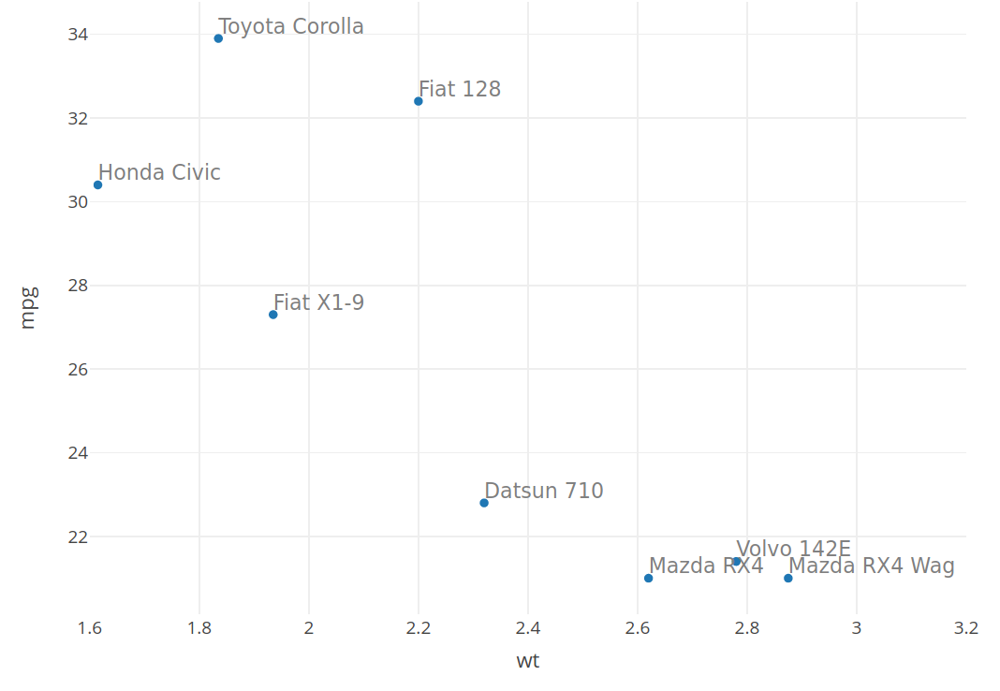
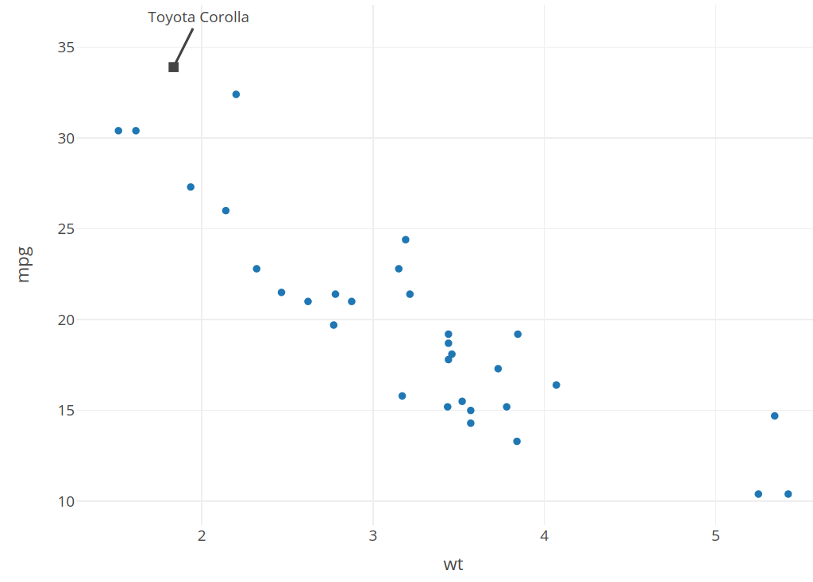

```{r setup, include=FALSE}
knitr::opts_chunk$set(echo = TRUE, warning = FALSE)
library(plotly)
library(dplyr)
library(plyr)
library(ggplot2)
library(ggpubr)
library(gganimate)
library(lubridate)
library(htmlwidgets)
library(crosstalk)
library(AER)
library(ggmap)
library(sp)
library(readxl)
library(janitor)
library(gifski)
library(gapminder)
```

# Introducción a plotly

Existen herramientas de visualización de datos como **D3.js**, pero la curva de aprendizaje para esas herramientas crece muy despacio con el tiempo. Es decir, además de requerir una mano experta en el lenguaje de programación JavaScript, también es importante tener mucha paciencia.

Una alternativa a la librería D3.js es la librería **plotly**, que además de ofrecer gráficas interactivas, no exige conocimientos avanzados de la programación. Podemos cargarla desde Github mediante la instrucción

``` cpp
devtools::install_github("ropensci/plotly")
```

aunque también podemos instalarlo de la forma habitual desde RStudio. [plotly](https://plotly.com/r/) es un paquete de R cuya principal característica es que es capaz de crear gráficos web interactivos utilizando la librería gráfica abierta JavaScript *plotly.js*. Los gráficos creados con el paquete *plotly* de R se renderizan localmente a través del framework **htmlwidgets**.

Incluso antes de la web, se demostró que los gráficos interactivos eran muy prometedores para ayudar a la exploración de datos de alta dimensión (D. Cook, Buja y Swayne 2007). La ASA (American Statistical Association) mantiene una increíble biblioteca de videos, <http://stat-graphics.org/movies/>, que documenta el uso de gráficos estadísticos interactivos para tareas que de otra manera no habrían sido fáciles o posibles usando resúmenes numéricos y/o gráficos estáticos por sí solos. En términos generales, estas tareas tienden a clasificarse en tres categorías:

-   Identificar la estructura que de otro modo desaparecería (J. W. Tukey y Fisherkeller 1973).

-   Diagnóstico de modelos y comprensión de algoritmos (Wickham, Cook y Hofmann 2015).

-   Ayudar al proceso de construcción de sentido mediante la búsqueda de información rápidamente sin preguntas completamente especificadas (Unwin y Hofmann 1999).

Hoy en día, se pueden encontrar y ejecutar algunos de estos y otros sistemas de interfaz gráfica de usuario (GUI) similares para crear gráficos interactivos: **DataDesk** <https://datadescription.com/>, **GGobi** <http://www.ggobi.org/>, **Mondrian** http: //www.theusrus.de/Mondrian/, **JMP** <https://www.jmp.com>, **Tableau** <https://www.tableau.com/>. Aunque estos sistemas basados en GUI tienen buenas propiedades, no encajan con un flujo de trabajo basado en código: cualquier tarea que complete a través de una GUI probablemente no pueda replicarse sin la intervención humana. Además, los sistemas basados en GUI suelen ser sistemas "cerrados" que no permiten personalizarlos, ampliarlos o integrarlos fácilmente con otro sistema.

Existe una función en la librería **plotly** que convierte un gráfico estático realizado con **ggplot2** a una versión interactiva en la web. La función que nos permite hacer esto es `ggplotly()`. Veamos un ejemplo con alguno de los gráficos que construimos en el capítulo donde hablamos de la librería *ggplot2*.

Volvemos a retomar la tabla sobre las publicaciones efectuadas por estudiantes de máster de Bioquímica que utilizamos en el tema de la librería **ggplot2**. La cargamos a partir de la librería de datos *AER*:

```{r, include=FALSE}
library(AER)
data("PhDPublications")
```

El primer gráfico que hicimos con esta tabla fue el número total de artículos publicados por los alumnos, sin distinguir ningún parámetro. El gráfico era el siguiente:

```{r}
gf <- ggplot(PhDPublications, aes(x = articles)) + 
  geom_bar(color = "white", fill = "black") + 
  theme_classic()

ggplotly(gf)
```

Simplemente en la última línea de código, hemos convertido el gráfico a interactivo mediante `ggplotly(gf)`. Notemos la diferencia de este gráfico con el que construimos en el capítulo anterior utilizando **ggplot**; ahora, cuando nos movemos con el ratón por las líneas aparece la información de los datos asociados a cada punto. Además, un menú interactivo nos permite realizar una serie de acciones como por ejemplo hacer zoom, capturar una imagen del gráfico, ampliar una zona, y otras.

Si hacemos lo mismo sobre un gráfico algo más elaborado, como por ejemplo el que mostramos a continuación, la diferencia es mucho más destacable cuando añadimos la opción de interactividad.

```{r}
gf <- ggplot(PhDPublications, aes(x = articles, fill = gender))+
        geom_histogram(bins = 19, aes(y=..density..), alpha=0.5, position="identity")+
        geom_density(alpha=.2)  +
        scale_x_continuous(breaks = seq(0,19,1)) +
        facet_grid(gender ~ .) +
        ggtitle("Artículos publicados por estudiantes de Máster") + 
        xlab("Número de artículos") + ylab("Estudiantes") +
        theme_bw()

ggplotly(gf) %>% layout(showlegend = FALSE)
```

Observamos que aunque el resultado puede no ser el deseado, esto es un recurso que siempre podemos utilizar cuando tengamos un gráfico realizado con **ggplot**. A continuación exploraremos algunas de las características esenciales de esta librería que nos va a permitir construir gráficos interesantes desde el punto de vista de su interactividad.

# Primeros gráficos con poltly

Comenzamos realizando gráficos sencillos con la librería, de distintos tipos, utilizando algunos conjuntos de datos.

## Características generales

Veamos algunas características importantes de esta librería que nos serán útiles para la creación de los gráficos. En general, [aquí](https://plotly.com/r/plotly-fundamentals/) podemos encontrar un buen número de ejemplos relacionados con todos los aspectos fundamentales de la librería.

-   Familias de fuentes que podemos utilizar con plotly.

Las familias de fuentes que se pueden utilizar en esta librería son: "Arial", "Balto", "Courier New", "Droid Sans",, "Droid Serif", "Droid Sans Mono", "Gravitas One", "Old Standard TT", "Open Sans", "Overpass", "PT Sans Narrow", "Raleway", "Times New Roman".

-   Título general y en los ejes de coordenadas.

El siguiente código de ejemplo nos muestra algunas de las opciones más habituales para definir un título al gráfico general y a los ejes.

``` yaml
layout(title = 'Título del gráfico',
         xaxis = list(title = 'Leyenda del eje X',
                      zeroline = TRUE,
                      range = c(0, 250)),
         yaxis = list(title = 'Leyenda del eje Y',
                      range = c(0,1400)),
         uniformtext=list(minsize=8, mode='hide'))
```

-   Propiedades de los Ejes

El código siguiente nos muestra propiedades de los ejes relacionadas con la separación entre marcas `dtick`, longitud y anchura de las marcas (`ticklen`, `tickwidth`) y el color (`tickcolor`).

``` yaml
library(plotly)
a <- list(
  autotick = FALSE,
  ticks = "outside",
  tick0 = 0,
  dtick = 0.25,
  ticklen = 5,
  tickwidth = 2,
  tickcolor = toRGB("blue")
)
fig <- fig %>% layout(xaxis = a, yaxis = a)
```

El código siguiente nos muestra opciones relacionadas con el estilo en los títulos de los ejes y las marcas. Creamos dos listas con familias de fuentes distintas que se utilizan para el título y para la fuente de las marcas. También se elimina del gráfico la leyenda mediante la opción `showlegend`.

``` yaml
library(plotly)
f1 <- list(
  family = "Arial, sans-serif",
  size = 18,
  color = "lightgrey"
)
f2 <- list(
  family = "Old Standard TT, serif",
  size = 14,
  color = "black"
)
a <- list(
  title = "AXIS TITLE",
  titlefont = f1,
  showticklabels = TRUE,
  tickangle = 45,
  tickfont = f2,
  exponentformat = "E"
)
fig <- fig %>% layout(xaxis = a, yaxis = a, showlegend = FALSE)
```

El código siguiente nos muestra estilos en los ejes y el los ejes coordenados ("Zero-Lines"). Si escribiéramos las opciones "zeroline = FALSE", "showline = FALSE", "showticklabels = FALSE", "showgrid = FALSE".

``` yaml
library(plotly)
ax <- list(
  zeroline = TRUE,
  showline = TRUE,
  mirror = "ticks",
  gridcolor = toRGB("gray50"),
  gridwidth = 2,
  zerolinecolor = toRGB("red"),
  zerolinewidth = 4,
  linecolor = toRGB("black"),
  linewidth = 6
)
fig <- fig %>% layout(xaxis = ax, yaxis = ax)
```

-   Eje logarítmico

Podemos crear un eje con escala logarítmica de la forma siguiente:

``` yaml
fig <- fig %>% layout(yaxis = list(type = "log"))
```

-   Hover Text

Podemos controlar lo que aparece cuando acercamos el ratón a cada dato, mediante la opción `text =`. Para una descripción más detallada de las posibilidades que nos ofrece la librería, podemos consultar <https://plotly.com/r/hover-text-and-formatting/>. Aquí vemos ahora un ejemplo.

``` yaml
fig <- plot_ly(iris, x = ~Petal.Length, y = ~Petal.Width, type = 'scatter', mode = 'markers',
        hoverinfo = 'text',
        text = ~paste('</br> Species: ', Species,
                      '</br> Petal Length: ', Petal.Length,
                      '</br> Petal Width: ', Petal.Width))
```

Otro ejemplo sería el siguiente:

``` yaml
t <- list(
  family = "sans serif",
  size = 14,
  color = toRGB("grey50"))

fig <- plot_ly(data, x = ~wt, y = ~mpg, text = rownames(data))
fig <- fig %>% add_markers()
fig <- fig %>% add_text(textfont = t, textposition = "top right")
fig <- fig %>% layout(xaxis = list(range = c(1.6, 3.2)),
         showlegend = FALSE)
fig
```

Este código nos proporciona la siguiente imagen:



-   Hacer una simple anotación en el gráfico.

Podemos hacer una simple anotación en el gráfico o un conjunto de anotaciones mediante la opción `annotations`. Podemos ver un ejemplo con la base de datos *mtcars*, donde se selecciona el máximo valor del mpg y se realiza una anotación sobre ese valor. Tenemos el código siguiente:

``` yaml
m <- mtcars[which.max(mtcars$mpg), ]

a <- list(
  x = m$wt,
  y = m$mpg,
  text = rownames(m),
  xref = "x",
  yref = "y",
  showarrow = TRUE,
  arrowhead = 7,
  ax = 20,
  ay = -40
)

fig <- plot_ly(mtcars, x = ~wt, y = ~mpg)
fig <- fig %>% add_markers()
fig <- fig %>% layout(annotations = a)

fig
```

Inicailmente tomamos *m* como el máximo de los valores *mpg*. Posteriormente se crea una lista con las características de la anotación, variable, texto, posición, etc. Notemos que el texto elegido para colocar en el punto de máxima *mpg* es el nombre de la fila `rownames(m)`. La forma de añadir la anotación es mediante `annotations = a`. La imagen sería:



Si quisiéramos añadir todos los marcadores a los puntos, utilizaríamos el código siguiente:

``` yaml
data <- mtcars[which(mtcars$am == 1 & mtcars$gear == 4),]

fig <- plot_ly(data, x = ~wt, y = ~mpg, type = 'scatter', mode = 'markers',
        marker = list(size = 10))
fig <- fig %>% add_annotations(x = data$wt,
                  y = data$mpg,
                  text = rownames(data),
                  xref = "x",
                  yref = "y",
                  showarrow = TRUE,
                  arrowhead = 4,
                  arrowsize = .5,
                  ax = 20,
                  ay = -40)

fig
```

Para un estudio más detallado de todas las opciones que tenemos en cuanto a inserción de texto y anotaciones en gráficos con plotly, véase <https://plotly.com/r/text-and-annotations/>.

## Tipos de gráfico más usuales con plotly

-   **scatter**

Un gráfico de este tipo (*scatter*) se inicializa con `plot_ly` o `add_trace`, siguiendo la sintaxis:

> plot_ly(df, type="scatter"[, ...]), add_trace(p, type="scatter"[, ...])

Un gráfico *scatter* acepta cualquiera de las claves que se listan en <https://plotly.com/r/reference/scatter/>.

-   **bar**

Un gráfico tipo *bar* (barras) se inicializa con `plot_ly` or `add_trace`siguiendo la sintaxis:

> plot_ly(df, type="bar"[, ...]), add_trace(p, type="bar"[, ...])

Un gráfico de barras acepta cualquiera de las claves listadas en <https://plotly.com/r/reference/bar/>. Los datos visualizados por la amplitud de las barras se establece en `y` si `orientation` es "v" (por defecto) y las etiquetas se establecen en `x`. Cambiando la `orientation` a "h", los papeles se intercambian.

-   **pie**

Un gráfico de tipo **pie** (tarta) se inicializa con `plot_ly` o `add_trace` siguiendo la sintaxis:

> plot_ly(df, type="pie"[, ...]), add_trace(p, type="pie"[, ...])

Un gráfico de este tipo acepta las claves listadas en <https://plotly.com/r/reference/pie/>. Un dato visualizado por los sectores de la tarta se establece en `values`. El sector de etiquetas se establece en `labels`.

-   **heatmap**

Un gráfico del tipo *heatmap* (mapa de calor) se inicializa con `plot_ly` o `add_trace` siguiendo la sintaxis:

> plot_ly(df, type="heatmap"[, ...]), add_trace(p, type="heatmap"[, ...])

Un gráfico de este tipo acepta las claves listadas en <https://plotly.com/r/reference/heatmap/>.

-   **Box**

Un gráfico de tipo *box* (caja) se inicializa con `plot_ly` or `add_trace`siguiendo la sintaxis:

> plot_ly(df, type="box"[, ...]), add_trace(p, type="box"[, ...])

Un gráfico de este tipo acepta las claves listadas en <https://plotly.com/r/reference/box/>. Cada caja abarca del cuartil 1 (Q1) al cuartil 3 (Q3). El segundo cuartil (Q2, es decir, la mediana) está marcado por una línea dentro del cuadro. Las líneas que crecen hacia afuera desde los bordes de las cajas, por defecto abarcan +/- 1.5 veces el rango intercuartílico (IQR: Q3-Q1). La media muestral y la desviación estándar, así como las muescas y la muestra, los valores atípicos y los puntos atípicos sospechosos pueden ser opcionalmente agregado al diagrama de caja.

-   **histogram**

Un gráfico de tipo *histogram* (histograma) se inicializa con `plot_ly` o \`add_trace:

> plot_ly(df, type="histogram"[, ...]), add_trace(p, type="histogram"[, ...])

Un gráfico de histograma acepta cualquiera de las claves enumeradas en <https://plotly.com/r/reference/histogram/>.

Los datos de muestra a partir de los cuales se calculan las estadísticas se establecen en `x` para histogramas que se extienden verticalmente y en `y` para histogramas que se extienden horizontalmente. Las opciones de agrupación se configuran como `xbins` y `ybins` respectivamente si no se proporcionan datos de agregación.

-   Scatter3d

Un gráfico \*\*scatter3d\*A\*\* se inicializa con `plot_ly` o `add_trace`:

> plot_ly(df, type="scatter3d"[, ...]), add_trace(p, type="scatter3d"[, ...])

Un gráfico scatter3d acepta cualquiera de las claves enumeradas en <https://plotly.com/r/reference/scatter3d/>.

Los datos visualizados como puntos de dispersión o líneas en dimensión 3D se establecen en `x`, `y`, `z`. El texto (que aparece en el gráfico o solo al pasar el mouse) se realiza a través de "texto". Los gráficos de burbujas se logran configurando `marker.size` y/o `marker.color`. Las proyecciones se logran mediante `projection`. Los rellenos de superficie se logran mediante "surfaceaxis".

# Algunos gráficos de ejemplo con plotly

Vamos a construir diversos tipos de gráficos con la librería para ver algunas características esenciales de la misma. Para ello, utilizaremos diversas tablas y conjuntos de datos.

## Gráficos con el data frame de la escolarización de la CV

Hemos obtenido los datos de escolarización de la Comunidad Valenciana durante el año 2019. En primer lugar importamos los datos, de la forma habitual.

```{r, include=FALSE}
esco_2019 <- read.csv("datos/resumen-de-escolarizacion_2019.csv", sep=";")
```

Vamos a tratar el data frame de manera que extraigamos los datos que nos interesan para el trabajo que vamos a desarrollar.

```{r}
head(esco_2019)
```

Tenemos columnas que especifican el curso académico, el código de centro (*COD_CENTRO*), el nombre del centro (*NOM_CENTRO*), la regulación Jurídica del centro (público o privado), si es público o privado, la localidad, el código del municipio, el nombre del municipio, el código de la provincia, el nombre de la provincia, el código de la enseñanza que imparte, la descripción del tipo de enseñanza, el código del curso impartido, el idioma, las unidades y los matriculados. De todos estos datos elegimos una columnas, que son las que contienen los datos más intersantes para nosotros. En concreto, dichas columnas son las siguientes:

| Columna      | Significado                  | Códigos                                                                               |
|------------------|---------------------------------|---------------------|
| COD_CENTRO   | código del centro            |                                                                                       |
| NOM_CENTRO   | nombre del centro            |                                                                                       |
| REG_JUR      | Régimen jurídico del centro  | PUB, PRI                                                                              |
| LOCALIDAD    | Nombre de la localidad       |                                                                                       |
| COD_PROV     | Código de la provincia       | 3 (Alacant), 12 (Castellón), 46 (Valencia)                                            |
| COD_ENSE     | Código enseñanza que imparte | 1 (Infantil), 2 (Primaria), 3 (Secundaria), 4 (Bachillerato), 18 (Educación Especial) |
| DES_ENSE_ES  | Descripción de la enseñanza  |                                                                                       |
| COD_CURSO    | Código curso impartido       | 3_6 INF, 1_6 PRI, 1_4 ESO, CIL, 1BAA, 1BAC, 1BAH, 2BAA, 2BAC, 2BAH                    |
| MATRICULADOS | Número matriculados          | PUB, PRI                                                                              |

Seleccionammos estas columnas de la tabla general.

```{r}
esco_2019 <- select(esco_2019, COD_CENTRO, NOM_CENTRO, REG_JUR, LOCALIDAD, COD_PROV, COD_ENSE, DESC_ENSE_ES, COD_CURSO, MATRICULADOS)
head(esco_2019)
```

Tenemos en esta tabla los datos de todos los centros de enseñanza de la Comundad Valenciana. Será nuestra referencia sobre la que vamos generando subtablas para nuestro estudio.

> Escolarización en la ciudad de Alicante

Un primer objetivo que se plantea es la distribución de la escolarización en la ciudad de Alicante. Para ello, construimos una tabla a partir de la general solamente con los datos de esta ciudad.

Para hacer esto, basta con seleccionar las filas correspondientes.

```{r}
datos_Alacant <- filter(esco_2019, esco_2019$LOCALIDAD == 'ALACANT')
```

Nos vamos a ir haciendo algunas preguntas sobre la escolarización en Alicante y vamos a estudiar la forma de responderlas a través de la visualización.

> ¿Cuántos estudiantes hay matriculados en centros públicos y privados?

Una primera aproximación a los datos sería determinar el número de matriculados en centros públicos y en centros privados.

```{r}
tabla1 <- ddply(datos_Alacant, .(REG_JUR), summarize, matricula = sum(MATRICULADOS))

tabla1
```

La construcción de esta tabla nos indica que hay matriculados 21010 estudiantes en centros privados y 30500 en centros públicos. Este simple código nos muestra los datos en un diagrama de tarta:

```{r}
plot_ly(tabla1, labels = ~REG_JUR, values = ~matricula, type = 'pie') %>% 
  layout(title = 'Matriculados en Alicante en centros públicos y privados en 2019')
```

> ¿Cuántos estudiantes hay matriculados por niveles de enseñanza?

Representamos gráficamente la distribución de matriculados por nivel de enseñanza.

```{r}
tabla2 <- ddply(datos_Alacant, .(DESC_ENSE_ES), summarize, matricula1 = sum(MATRICULADOS))

plot_ly(tabla2, labels = ~DESC_ENSE_ES, values = ~matricula1, type = 'pie') %>% 
  layout(title = 'Matriculados en Alicante por Enseñanza')
```

```{r}
tabla3 <- ddply(datos_Alacant, .(DESC_ENSE_ES,COD_CURSO), summarize, matricula2 = sum(MATRICULADOS))

plot_ly(tabla3, labels = ~COD_CURSO, values = ~matricula2, type = 'pie') %>% 
  layout(title = 'Matriculados en Alicante por Enseñanza')
```

> ¿Cuántos estudiantes hay matriculados por tipo de enseñanza y por nivel?

Podemos visualizar ahora los alumnos matriculados en la ciudad de Alicante por nivel de enseñanza. En primer lugar creamos una tabla ordenada siguiendo el régimen jurídico, después por el tipo de enseñanza y, por último, por el nivel dentro de la enseñanza recibida. Volvemos a contar el número de matriculados en cada caso.

```{r}
tabla4 <- ddply(datos_Alacant, .(REG_JUR, DESC_ENSE_ES, COD_CURSO), summarize, matricula3 = sum(MATRICULADOS))
head(tabla4)
```

Ahora realizamos el gráfico.

```{r}
fig <- plot_ly(tabla4, x = ~DESC_ENSE_ES, y = ~matricula3, type = 'bar', color = ~REG_JUR)
fig <- fig %>% layout(title = 'Matriculados en Alicante por tipo de Enseñanza',
         xaxis = list(
           title = "",
           tickfont = list(
             size = 12,
             color = 'rgb(107, 107, 107)')),
         yaxis = list(
           title = 'matriculados',
           titlefont = list(
             size = 12,
             color = 'rgb(107, 107, 107)'),
           tickfont = list(
             size = 12,
             color = 'rgb(107, 107, 107)')),
         legend = list(bgcolor = 'rgba(255, 255, 255, 0)', bordercolor = 'rgba(255, 255, 255, 0)'),
         barmode = 'group', bargap = 0.15)


fig
```

```{r}
fig <- plot_ly(tabla4, x = ~COD_CURSO, y = ~matricula3, type = 'bar', color = ~REG_JUR)
fig <- fig %>% layout(title = 'Matriculados en Alicante por                                                                                                                                  nivel de Enseñanza',
         xaxis = list(
           title = "",
           tickangle = -75,
           tickfont = list(
             size = 11,
             color = 'purple')),
         yaxis = list(
           title = 'matriculados',
           titlefont = list(
             size = 14,
             color = 'purple'),
           tickfont = list(
             size = 12,
             color = 'gray')),
         legend = list(bgcolor = 'rgba(255, 255, 255, 0)', bordercolor = 'rgba(255, 255, 255, 0)'),
         barmode = 'group', bargap = 0.15)

fig
```

> ¿Cuántos estudiantes se han matriculado en cada centro de enseñanza?

Para contestar a esta pregunta debmos construir previamente una tabla con los valores adecuados para su representación. Lo hacemos de la forma habitual, agrupando por código de centro, que es un identificativo del mismo.

```{r}
tabla5 <- ddply(datos_Alacant, .(COD_CENTRO, NOM_CENTRO, COD_ENSE, DESC_ENSE_ES), summarize, matricula6 = sum(MATRICULADOS))
head(tabla5)
```

Ahora representamos un gráfico con estos datos. Vamos a controlar en el siguiente gráfico lo que aparece en lo que conocemos como el `hover text`, es decir, la leyenda que se visualiza cuando acercamos el ratón al dato. Lo hacemos mediante la instrucción `text`. Visualizamos en un gráfico de puntos los matriculados de cada centro, por niveles educativos. Si nos acercamos a cada punto aparece el nombre de centro, los matriculados y el nivel.

```{r}
fig <- plot_ly(data = tabla5, x = ~COD_CENTRO, y = ~matricula6, color = ~DESC_ENSE_ES, type = 'scatter', mode = 'markers',
                text = ~paste("Centro: ", NOM_CENTRO))
fig <- fig %>% layout(title = 'Matriculados en Alicante por centro de Enseñanza',
           legend = list(orientation = 'h'),
           xaxis = list(
           title = " ",
           tickfont = list(
             size = 11,
             color = 'purple')),
         yaxis = list(
           title = 'matriculados',
           titlefont = list(
             size = 14,
             color = 'purple'),
           tickfont = list(
             size = 12,
             color = 'gray')))

fig
```

Ahora lo que hacemos es incluir una caracteristica de los gráficos basada en la función `highlight_key()` y `highlight`.

```{r}
tabla5 %>%
  highlight_key(~COD_ENSE) %>%
  plot_ly(
    x = ~COD_CENTRO, y = ~matricula6, type = 'scatter', color = ~DESC_ENSE_ES, text = ~COD_ENSE, mode = "markers+text", textposition = "top", hoverinfo = "x+y") %>%
  highlight(on = "plotly_hover", off = "plotly_doubleclick") %>%
  layout(title = 'Matriculados en Alicante por centro de Enseñanza',
           legend = list(orientation = 'h'),
           xaxis = list(
           title = " ",
           tickfont = list(
             size = 11,
             color = 'purple')),
         yaxis = list(
           title = 'matriculados',
           titlefont = list(
             size = 14,
             color = 'purple'),
           tickfont = list(
             size = 12,
             color = 'gray')))
```

Lo que conseguimos es que cuando acercamos el ratón a un dato, se iluminen todos los datos que presentan el mismo valor que seleccionamos con la función `highlight_key()`. Nosotros escribimos `highlight_key(~COD_ENSE)` para que los grupos que se iluminen sean los del mismo nivel de enseñanza. Con la instrucción `highlight(on = "plotly_hover", off = "plotly_doubleclick")` hacemos que cuando presionamos doble click en el gráfico volvemos a desactivar la acción anterior.

Hablando en general, la instrucción `highlight_key()` asigna los valores de los datos a las marcas gráficas de manera que cuando las marcas gráficas son *directly manipulated* por medio de la instrucción `on`, utiliza los correspondientes valores de los datos (es decir, `$SELECTION_VALUE`) para llevar a cabo una llamada SQL query de la forma siguiente:

``` yaml
SELECT * FROM mtcars WHERE cyl IN $SELECTION_VALUE
```

> ¿Hay un porcentaje de alumnos similar matriculados en centros públicos y privados en las tres capitales Alicante, Valencia y Castellón?

Para ello, debemos seleccionar los datos relacionados con Alicante, Valencia y Castellón.

```{r}
datos_capitales <- filter(esco_2019, LOCALIDAD %in% c("ALACANT", "CASTELLÓ DE LA PLANA", "VALÈNCIA"))
```

Debemos crear una tabla con los datos necesarios para la cuestión que debemos plantear.

```{r}
capitales <- ddply(datos_capitales, .(LOCALIDAD, REG_JUR), summarize, matricula = sum(MATRICULADOS))
  
head(capitales)
```

> Cuestión: ¿Cómo podemos representar los datos de la tabla *capitales*?

## Gráficos con el data frame de la COVID19

En primer lugar, tomamos el data set de los datos de la COVID19 en España que ya trabajamos en el capítulo de *ggplot*. Comenzamos importando los datos.

```{r}
datos_ccaas <- read.csv("datos/datos_ccaas_0507.csv", row.names=NULL, sep=";")
datos_CCAA <- datos_ccaas
datos_CCAA <- select(datos_CCAA, ccaa_iso, fecha, num_casos, casos_ac)
datos_CCAA$fecha <- as.Date(datos_CCAA$fecha, format = "%Y-%m-%d")
datos_CCAA <- arrange(datos_CCAA, fecha)
head(datos_CCAA)
```

```{r}
colo <- c('#641E16','#106A34','#9894D2','#CD38B0','#F0213D','#0DE55F','#7E38DE','#111011','#E8EF0D','#5A4B60','#F2D2C2','#6B2A0A','#7DD737',
          '#3834C0','#1520C1','#5C0C10','#929542','#3F0BF0','#297C48')
fig <- plot_ly(data = datos_CCAA, x = ~fecha, y = ~num_casos, color = ~ccaa_iso, type = 'scatter', mode = 'lines', colors = colo,
        hoverinfo = 'text',
        text = ~paste('</br> Casos: ', num_casos, ccaa_iso, fecha))  %>% 
      layout(
    title = "Casos de infectados por Comunidades Autónomas",
      xaxis = list(
        title = " ",
        type = 'date',
        tickformat = "%m %B")
    )

fig
```

En el gráfico anterior, dada la cantidad de líneas que se dibujan (19, una por cada Comunidad Autónoma), no resulta visualmente atractiva la visión de los datos concretos de una Autonomía. Podemos hacer uso de la función `highlight_key()` para seleccionar la línea de datos que nos interesa ver. Lo hacemos mediante el código siguiente.

```{r message=FALSE, warning=FALSE}
tx <- highlight_key(datos_CCAA, ~ccaa_iso, "Selecciona Comunidad")

#Ahora iniciamos el objeto plotly
base <- plot_ly(tx, color = I('#3d3b72'), colors="Accent") %>% 
  group_by(ccaa_iso)

# Creamos el gráfico como time series.

base %>%
  group_by(ccaa_iso) %>%
  add_lines(x = ~fecha, y = ~num_casos)  %>%
  highlight(
  on = "plotly_click", off = "plotly_doubleclick",
  selectize = TRUE, 
  dynamic = TRUE, 
  persistent = TRUE
)  %>%
  layout(
    xaxis = list(
        title = "fecha",
        type = 'date',
        tickformat = "%m %B"),
    yaxis = list(title = "Casos") )

```

Hemos visto una descripción general del marco de *plotly* para eventos destacados mediante la instrucción `highlight_key()`, pero también admite eventos de filtro mediante la instrucción `filter_select()`. Estos eventos desencadenan una lógica ligeramente diferente:

-   Un evento de resaltado atenúa la opacidad de las marcas existentes y luego agrega una capa gráfica adicional que representa la selección.

-   Un evento de filtro elimina completamente las marcas existentes y cambia la escala de los ejes a los datos restantes

Al menos actualmente, los eventos de filtro deben dispararse desde los widgets de filtro del paquete *crosstalk*, y estos widgets esperan un objeto de clase `SharedData` como entrada. Como resultado, la función `highlight_key()` crea una instancia `SharedData` y es esencialmente un contenedor para `crosstalk::SharedData$new()`. Por lo tanto, debemos cargar inicialmente la librería **crosstalk** en el inicio.

La librería *crosstalk* es un complemento del paquete `htmlwidgets`. Extiende `htmlwidgets` con un conjunto de clases, funciones y convenciones para implementar interacciones entre widgets (actualmente, cepillado y filtrado vinculados).

Veamos un ejemplo.

```{r}
library(crosstalk)

tx <- highlight_key(datos_CCAA)
gg <- ggplot(tx) + geom_line(aes(fecha, num_casos, group = ccaa_iso))
filter <- bscols(
  filter_select("ccaa_iso", "Seleccionar una Comunidad", tx, ~ccaa_iso),
  ggplotly(gg, dynamicTicks = TRUE),
  widths = c(12, 12)
)

tx2 <- highlight_key(datos_CCAA, ~ccaa_iso, "Seleccionar una Comunidad")
gg <- ggplot(tx2) + geom_line(aes(fecha, num_casos, group = ccaa_iso))
select <- highlight(
  ggplotly(gg, tooltip = "Comunidad"), 
  selectize = TRUE, persistent = TRUE
)

bscols(filter, select)
```

Vemos en estos dos gráficos la diferencia entre utilizar `filter_select()` o la opción que venimos utilizando de `highlight_key()`.

Ahora haremos el gráfico de los contagiados acumulados, con el fin de conocer las contagiados totales por Comunidades Autónomas.

```{r}
colo <- c('#641E16','#106A34','#9894D2','#CD38B0','#F0213D','#0DE55F','#7E38DE','#111011','#E8EF0D','#5A4B60','#F2D2C2','#6B2A0A','#7DD737', '#3834C0','#1520C1','#5C0C10','#929542','#3F0BF0','#297C48')
t <- list(
  family = "Gravitas One",
  size = 10,
  color = 'black'
)

fig <- plot_ly(data = datos_CCAA, x = ~fecha, y = ~casos_ac, color = ~ccaa_iso, type = 'scatter', mode = 'markers', colors = colo,
        hoverinfo = 'text',
        text = ~paste("Casos: ", casos_ac, '<br>Comunidad:', ccaa_iso, '<br>Fecha:', fecha))  %>% 
      layout(
    title = "Casos acumulados de infectados por Comunidades Autónomas", font = t,
      xaxis = list(
        title = " ",
        type = 'date',
        tickformat = "%m %B"),
     yaxis = list(title = "Casos acumulados")
    )

fig
```

Podemos mejorar este gráfico utilizando la instrucción `highlight_key()` de la forma:

```{r}
tx <- highlight_key(datos_CCAA, ~ccaa_iso, "Selecciona Comunidad")

#Ahora iniciamos el objeto plotly
base <- plot_ly(tx, color = I("gray"),
            hoverinfo = 'text',
            text = ~paste("Casos: ", casos_ac, '<br>Comunidad:', ccaa_iso, '<br>Fecha:', fecha)) %>% 
  group_by(ccaa_iso)

# Creamos el gráfico como time series.

base %>%
  group_by(ccaa_iso) %>%
  add_markers(x = ~fecha, y = ~casos_ac)  %>%
  highlight(
  on = "plotly_click", off = "plotly_doubleclick",
  selectize = TRUE, 
  dynamic = TRUE, 
  persistent = TRUE
)  %>%
  layout(
    xaxis = list(title = "fecha"),
    yaxis = list(title = "Casos acumulados") )

```

También nos podemos plantear dibujar los datos sobre un diagrama de barras. Para conocer los datos, necesitamos los acumulados totales.

```{r}
datos_totales <- filter(datos_CCAA, datos_CCAA$fecha == '2020-07-05')
datos_totales$fecha <- as.Date(datos_totales$fecha, format = "%Y-%m-%d")
datos_totales[10,4] = 5701
datos_totales
```

```{r}
#colors1 <- colorRampPalette(list('yellow', 'red'))

fig <- plot_ly(datos_totales, x = ~ccaa_iso, y = ~casos_ac, type = 'bar', hoverinfo = 'text',
            text = ~paste("Casos: ", casos_ac, '<br>Comunidad:', ccaa_iso),
             marker = list(color = 'green',
                           line = list(color = 'rgb(8,48,107)', width = 1.5)))
fig <- fig %>% layout(title = "Casos totales de COVID19 (5 julio)",
         xaxis = list(title = ""),
         yaxis = list(title = "casos acumulados"))

fig
```

> Comparando datos de la comunidad de Madrid y la Comunidad Valenciana.

Vamos a comenzar dibujando los datos de contagios de la COVID19 en las comunidades de Madrid y Valencia. En primer lugar, construimos una tabla donde aparezcan los valores relativos a las comunidades de Madrid y Valencia. La construimos utilizando el comando `filter`, de la forma siguiente:

```{r}
datos1 <- filter(datos_CCAA, ccaa_iso %in% c("MD", "VC"))
```

Ahora ya podemos representar los datos de ambas comunidades.

```{r}
t <- list(
  family = "Arial",
  size = 12,
  color = 'black'
)
fig <- plot_ly(datos1, x = ~fecha, y = ~num_casos, type = 'scatter', mode = 'markers', color = ~ccaa_iso, colors = c("red","blue"))  %>%
  layout(
  title = "Datos COVID19 de Madrid y Comunidad Valenciana", font = t,
  xaxis = list(
           title = "",
           tickangle = -35,
           tickfont = list(
             size = 11,
             color = 'purple')),
  yaxis = list(
           title = "Casos",
           tickfont = list(
             size = 11,
             color = 'purple'))
  )

fig
```

## Gráficos con el data frame de los estudiantes de Máster

Cargamos la librería *AER* e importamos el data set *PhDPublications*. Así, hacemos

```{r, include=FALSE}
library(AER)
data("PhDPublications")
```

Recordemos que este data set consta de 915 observaciones (estudiantes) y se recogen 6 variables: *articles*, el número de artículos publicados por los estudiantes durante los últimos 3 años, *gender*, el género del estudiante, *married* se refiere a si el estudiante está casado/a, *kids* es número de niños menores de 6 años, *prestige* es el factor de prestigio del programa de graduado y *mentor* es el número de artículos publicados por el director o mentor del estudiante.

Utilizando las posibilidades que nos ofrecen las librerías **crosstalk** y **plotly** construimos un gráfico donde representamos en un histograma el número de artículos publicados por esta muestra de estudiantes de doctorado, junto con la información asociada al histograma de los estudiantes referente al género, al número de niños que tienen (como un cuadro de casillas) y a los artículos publicados por el mentor (como una barra deslizadora).

```{r}
tx <- highlight_key(PhDPublications)
widgets <- bscols(
  widths = c(10, 10, 10),
  filter_select("genero", "Gender", tx, ~gender),
  filter_checkbox("niños", "Kids", tx, ~kids, , inline = TRUE),
  filter_slider("papers", "Mentor", tx, ~mentor)
)
bscols(
  widths = c(4, 8), widgets, 
  plot_ly(tx, x = ~articles, type = "histogram", showlegend = FALSE) %>%
    layout(title = "Artículos publicados de alumnos de Máster", bargap=0.1,
         xaxis = list(title = "Artículos"),
         yaxis = list(title = ""))
)
```

# Animación con *ggplot* y *plotly*

Al igual que cuando hacemos un gráfico con ggplot2, lo primero que necesitamos para crear animaciones en R con gganimate es que nuestros datos tengan la forma necesaria para poder dibujarlos correctamente.

Como casi siempre a la hora de graficar, necesitaremos que los datos tengan una estructura tidy , es decir, los datos cumplan los siguientes tres puntos:

-   Cada columna debe ser una variable.

-   Todas las filan deben referirse a una observación.

-   Cada celda debe contener un único valor.

En nuestro caso usaremos el dataset `gapminder`, al ser un clásico de las animaciones. Comenzamos cargando los datos.

```{r}
datos = gapminder
head(datos)
```

La tabla nos muestra datos sobre los diferentes países, la población, la esperanza de vida y la renta per cápita. El producto interno bruto (PIB) per cápita es una métrica que desglosa la producción económica por persona de un país y se calcula dividiendo el PIB de un país por su población. Estos datos se muestran como una serie temporal desde el año 1952.

## Creando la animación en R con plotly

Para una introducción en los gráficos animados con *plotly*, podemos consultar [esta página](https://plotly.com/r/animations/), de la que hemos sacado algunos de los ejemplos expuestos.

Intentamos la animación con las posibilidades que nos ofrece la librería *plotly*. La opción clave es `frame =`.

```{r}
fig <- datos %>%
  plot_ly(
    x = ~gdpPercap, 
    y = ~lifeExp, 
    size = ~pop, 
    color = ~continent, 
    frame = ~year, 
    text = ~country, 
    hoverinfo = "text",
    type = 'scatter',
    mode = 'markers'
  )
fig <- fig %>% layout(
    xaxis = list(
      title = "PBI",
      type = "log"
    ),
    yaxis = list(
      title = "Esperanza de vida"
    )
  )
 fig  <-  fig %>%
  animation_opts(100, easing = "elastic", redraw = FALSE) %>%
  animation_button(x = 1, xanchor = "right", y = 0, yanchor = "bottom")  %>%
  animation_slider(currentvalue = list(prefix = "año: ", font = list(color="blue")))
fig
```

Las animaciones se pueden crear usando el argumento frame en `plot_ly()` o la estética frame `ggplot2` (no oficial) en `ggplotly()`. De forma predeterminada, las animaciones permiten crear un botón de reproducción y un componente deslizante para controlar el estado de la animación (para pausar una animación, haga clic en una ubicación relevante en la barra deslizante). Tanto el botón de reproducción como la componente deslizante hacen la transición entre cuadros de acuerdo con las reglas especificadas por `animation_opts()`. La forma de la función `animation_opts()` es:

``` yaml
animation_opts(
  p,
  frame = 500,
  transition = frame,
  easing = "linear",
  redraw = TRUE,
  mode = "immediate"
)

animation_slider(p, hide = FALSE, ...)

animation_button(p, ..., label)
```

donde `p` es el objeto plotly, `frame` es la cantidad de tiempo entre los frames (en milisegundos), `transition` es la duración de la transición entre frames (en milisegundos), `easing` es el tipo de transición, `redraw` desencadena un rediseño del gráfico al finalizar la transición.

La opción `mode` describe cómo una nueva llamada animada interactúa con las animaciones que se están ejecutando actualmente. Si es `inmediate`, las animaciones actuales se interrumpen y se inicia la nueva animación. Si es `next`, se permite que se complete el fotograma actual, después de lo cual se inicia la nueva animación. Si es `afterall`, todos los fotogramas existentes se animan hasta su finalización antes de que se inicie la nueva animación.

Mediante la opción `hide` se elimina la barra de animación.

Para entender las opciones y atributos de `animation_slider`, se puede consultar este [enlace](https://github.com/plotly/plotly.js/blob/master/src/components/sliders/attributes.js). Sin embargo, para conocer los atributos y características de `animation_button`, se puede consultar el [enlce](https://github.com/plotly/plotly.js/blob/master/src/components/updatemenus/attributes.js)

Si comparamos las dos animaciones, la animación hecha con *plotly* es mucho más interesante desde el punto de vista que introduce interactividad en el gráfico. Podemos seleccionar el continente en la leyenda y ver los países del continente seleccionado en la evolución de los datos con los años. La barra con los años nos permite realizar la animación completa o visualizar un año concreto. Estas posibilidades no las tenemos con *ggplot*.

Ahora podemos crear una animación distinta. Si el `frame` es una variable numérica (o una cadena de caracteres), los marcos siempre se ordenan en orden ascendente (alfabético); pero para los factores, el orden refleja el orden de los niveles. En consecuencia, los factores proporcionan el mayor control sobre el orden de los marcos. En la gráfica siguiente, los continentes (es decir, los frames) están ordenados según su esperanza de vida promedio en los países del continente. Además, dado que no existe una relación significativa entre los objetos en los diferentes marcos de la gráfica, la duración de la transición suave se establece en 0. Esto ayuda a evitar cualquier confusión de que existe una conexión significativa entre las transiciones suaves. Tenga en cuenta que estas opciones controlan ambas animaciones activadas por el botón de reproducción o mediante el control deslizante.

```{r}
meanLife <- with(datos, tapply(lifeExp, INDEX = continent, mean))
datos$continent <- factor(
  datos$continent, levels = names(sort(meanLife))
)

base <- plot_ly(x = ~gdpPercap, y = ~lifeExp, size = ~pop, 
          text = ~country, hoverinfo = "text") %>%
  layout(xaxis = list(type = "log"))
  
base %>%
  add_markers(data = datos, frame = ~continent, color = ~continent) %>%
  hide_legend() %>%
  animation_opts(frame = 1000, transition = 0, redraw = FALSE)
```

## Ejemplo: datos sobre ERTES en la Comunidad Valenciana

Un **ERTE** es el procedimiento que han de realizar las empresas cuando, como consecuencia de causas económicas, técnicas, organizativas o de producción tengan que suspender temporalmente la totalidad o parte de su actividad, con la consiguiente suspensión de los contratos de trabajo o la reducción temporal de la jornada de trabajo de las personas trabajadoras en dicha empresa. Una vez tomada esta medida, el trabajador verá cómo su jornada laboral se reduce entre un 10% y un 70% sobre su trabajo diario, semana, mensual o anual.

Durante el ERTE el trabajador cobrará la prestación de desempleo que le corresponde, igual que si hubiera sido despedido definitivamente, es decir, percibe el 70% de la base reguladora (un indicador utilizado para calcular prestaciones que es ligeramente inferior al salario). Esta es la cantidad que se percibe durante los primeros seis meses en paro, a partir del séptimo se ingresa el 50%. Además, el empresario tendrá que mantener dado de alta al trabajador y seguir pagando el 100% de la seguridad social. La duración del ERTE no tiene límite de tiempo.

Un **ERE** es un mecanismo laboral especial dirigido a empresas en crisis que les permiten una reducción de trabajadores. Hay 3 tipos:

-   ERE de reducción de jornada: En este ERE se reduce la jornada laboral de los trabajadores, en lugar de suspenderla por completo. El trabajador continúa en su puesto, pero trabajando menos horas o menos días.

-   ERE de suspensión: En este caso, la empresa establece un nuevo calendario laboral a sus trabajadores señalándoles los días en los que no habrá actividad laboral. Consiste en mandar al trabajador a casa unos días en concreto.

-   ERE de extinción: Este ERE es el más conocido y consiste en un despido colectivo de la plantilla. Supone la finalización definitiva de la relación laboral entre empresa y parte de los trabajadores. Es la opción más desfavorable para los empleados.

En el portal de datos abiertos de la Comunidad Valenciana <http://portaldadesobertes.gva.es/es/comunitat-oberta> podemos encontrar datos en abierto sobre los ERE y ERTE solicitados y resueltos en la Comunidad Valenciana.

Comenzamos importando los datos.

```{r}
ere_erte_CV_30agosto <- read.csv("datos/ere_erte_CV_30agosto.csv", sep=";")
```

La tabla *ere_erte_CV_30agosto* consta de 93968 registros con 43 columnas (variables). De todos estos, tenemos una serie de variables que nos interesa aislar para no contar con toda la tabla y reducir su tamaño. Estas columnas son:

-   FECHA_SOLICITUD: fecha de solicitud del ere/erte.

-   EMPRESA_PROV: código de la provincia a la que pertenece la empresa.

-   PROVINCIA: Nombre de la provincia.

-   MUNICIPIO: Municipio de la empresa.

-   SECTOR: Sector de la empresa (Agricultura, Servicios, Industria, Construcción, ...)

-   TOTAL_TRAB_EXT: Total de personas trabajadoras para las cuales se ha solicitado extinción.

-   TOTAL_TRAB_RED: Total de personas trabajadoras para las cuales se ha solicitado reducción.

-   TOTAL_TRAB_SUS: Total de personas trabajadoras para las cuales se ha solicitado suspensión.

-   TOTAL_CON_TRAB_EXT: Total de trabajadores con concesión de extinción.

-   TOTAL_CON_TRAB_RED: Total de trabajadores con concesión de reducción.

-   TOTAL_CON_TRAB_SUS: Total de trabajadores con concesión de suspensión.

En primer lugar, vamos a tomar de la tabla global los datos referentes a la provincia de Alicante. Para ello hacemos:

```{r}
datos_ALI <- filter(ere_erte_CV_30agosto, ere_erte_CV_30agosto$PROVINCIA == 'Alicante/Alacant')
```

Ahora elegimos las columnas que nos interesan de la tabla. Después, convertimos la columna de la fecha de solicitud en una variable del tipo *date* y especificamos su formato. También tomamos los datos desde el año 2020, eliminando los datos anteriores a ese año (hay registros desde 2007).

```{r}
datos_ALI <- select(datos_ALI, FECHA_SOLICITUD,MUNICIPIO,SECTOR,TOTAL_TRAB_EXT,TOTAL_TRAB_RED,TOTAL_TRAB_SUS, TOTAL_CON_TRAB_EXT,TOTAL_CON_TRAB_RED,TOTAL_CON_TRAB_SUS)

datos_ALI$FECHA_SOLICITUD <- as.Date(datos_ALI$FECHA_SOLICITUD, format = "%Y/%m/%d")

datos_ALI <- filter(datos_ALI, datos_ALI$FECHA_SOLICITUD > "2020-01-01")
```

Ampliamos la tabla de Alicante con las columnas suma de los ERE (extinción + reducción + suspensión).

```{r}
datos_ALI$ERE <- datos_ALI$TOTAL_TRAB_EXT + datos_ALI$TOTAL_TRAB_RED + datos_ALI$TOTAL_TRAB_SUS
```

```{r}
datos_ALI$TOTAL_CON_TRAB_EXT <- as.numeric(datos_ALI$TOTAL_CON_TRAB_EXT)
datos_ALI$TOTAL_CON_TRAB_RED <- as.numeric(datos_ALI$TOTAL_CON_TRAB_RED)
datos_ALI$TOTAL_CON_TRAB_SUS <- as.numeric(datos_ALI$TOTAL_CON_TRAB_SUS)

datos_ALI$ERE_CON <- datos_ALI$TOTAL_CON_TRAB_EXT + datos_ALI$TOTAL_CON_TRAB_RED + datos_ALI$TOTAL_CON_TRAB_SUS
```

Ahora creamos una columna con el mes de la fecha.

```{r}
datos_ALI$mes = month(datos_ALI$FECHA_SOLICITUD)
datos_ALI <- select(datos_ALI, FECHA_SOLICITUD, mes, MUNICIPIO, SECTOR, ERE, ERE_CON)
```

Tomamos la tabla **datos_ALI** como la tabla base. Ahora formamos una tabla nueva donde agrupamos los datos siguiendo el primer criterio de la fecha, el segundo del municipio

``` yaml
datos_ALI1 <- datos_ALI %>% 
         group_by(FECHA_SOLICITUD,MUNICIPIO,SECTOR)  %>%
         summarise(ERE = sum(TOTAL_TRAB_EXT), .groups = 'drop')
head(datos_ALI1)
```

```{r}
datos_ALI1 <- datos_ALI %>% 
         dplyr::group_by(FECHA_SOLICITUD,mes,MUNICIPIO,SECTOR)  %>%
         dplyr::summarise(ERE = sum(ERE), .groups = 'drop')
#datos_ALI1$FECHA_SOLICITUD <- as.Date(datos_ALI1$FECHA_SOLICITUD, format = "%Y-%m-%d")
head(datos_ALI1)
```

Ahora tratamos de visualizar un gráfico interactivo con *plotly* donde se muestran todos los municipios de la provincia de Alicante con empresas que han realizados ERES.

```{r}
t <- list(
  family = "Gravitas One",
  size = 10,
  color = 'black'
)

fig <- datos_ALI %>%
  plot_ly(
    x = ~FECHA_SOLICITUD, 
    y = ~ERE, 
    color = ~MUNICIPIO, 
    text = ~paste("Municipio: ", MUNICIPIO, '<br>ERES:', ERE, '<br>Fecha:', FECHA_SOLICITUD), 
    hoverinfo = "text",
    type = 'scatter',
    mode = 'markers'
  )  %>%
  layout(
    title = "Casos acumulados de infectados por Comunidades Autónomas", font = t,
      xaxis = list(
        title = "Fecha solicitud ERE",
        type = 'date',
        tickformat = "%m %B"),
     yaxis = list(title = "Número de trabajadores en ERE")
    )

# fig  <-  fig %>%
#  animation_opts(1000, easing = "elastic", redraw = FALSE) %>%
#  animation_button(x = 1, xanchor = "right", y = 0, yanchor = "bottom")  %>%
#  animation_slider(currentvalue = list(prefix = "mes: ", font = list(color="orange")))

 fig
```

De este gráfico vamos ahora aseleccionar aquéllos datos más significativos, es decir, aquéllas empresas que han solicitado ERES con un mayor número de puestos de trabajo involucrados en el expediente. Para eso, hacemos una selección antes del gráfico.

```{r}
fig <- datos_ALI %>%
  filter(ERE > 75)  %>%
  plot_ly(
    x = ~FECHA_SOLICITUD, 
    y = ~ERE, 
    color = ~MUNICIPIO, 
    text = ~paste("Municipio: ", MUNICIPIO, '<br>ERES:', ERE, '<br>Fecha:', FECHA_SOLICITUD), 
    hoverinfo = "text",
    type = 'scatter',
    mode = 'markers'
  )  %>%
  layout(
    title = "Casos acumulados de infectados por Comunidades Autónomas", font = t,
      xaxis = list(
        title = "Fecha solicitud ERE",
        type = 'date',
        tickformat = "%m %B"),
     yaxis = list(title = "Número de trabajadores en ERE")
  )
 fig
```

Ahora nos hacemos la pregunta siguiente: ¿Cómo son los datos del año 2020 respecto a otros años, como por ejemplo el año 2019? ¿Cómo ha afectado la pandemia del COVID19 a los expendientes de regulación de empleo este año? ¿Podemos comparar los datos con otros años?

```{r}
datos_ALI2 <- filter(ere_erte_CV_30agosto, ere_erte_CV_30agosto$PROVINCIA == 'Alicante/Alacant')
#Seleccionamos las columnas que queremos
datos_ALI2 <- select(datos_ALI2, FECHA_SOLICITUD,MUNICIPIO,SECTOR,TOTAL_TRAB_EXT,TOTAL_TRAB_RED,TOTAL_TRAB_SUS, TOTAL_CON_TRAB_EXT,TOTAL_CON_TRAB_RED,TOTAL_CON_TRAB_SUS)
#Convertimos la variable fecha a clase date
datos_ALI2$FECHA_SOLICITUD <- as.Date(datos_ALI2$FECHA_SOLICITUD, format = "%Y/%m/%d")
#Tomamos los datos desde el 2015
datos_ALI2 <- filter(datos_ALI2, datos_ALI2$FECHA_SOLICITUD > "2015-01-01")
#Creamos una nueva columna con el número total de ERES (ext, red, sus)
datos_ALI2$ERE <- datos_ALI2$TOTAL_TRAB_EXT + datos_ALI2$TOTAL_TRAB_RED + datos_ALI2$TOTAL_TRAB_SUS
#Creamos una nueva columna con el año.
datos_ALI2$año <- year(datos_ALI2$FECHA_SOLICITUD)
#Seleccionamos las columnas que nos interesan
datos_ALI2 <- select(datos_ALI2, año, FECHA_SOLICITUD,MUNICIPIO,SECTOR,ERE)
```

Ahora hacemos un gráfico.

```{r}
fig <- datos_ALI2 %>%
  plot_ly(
    x = ~año, 
    y = ~ERE, 
    color = ~año, 
    text = ~paste("Municipio: ", MUNICIPIO, '<br>ERES:', ERE, '<br>Fecha:', FECHA_SOLICITUD), 
    hoverinfo = "text",
    type = 'scatter',
    mode = 'markers',
    size = ~ERE
  )  %>%
  layout(
    title = "ERES en la provincia de Alicante", font = t,
      xaxis = list(
        title = "Fecha solicitud ERE",
        type = 'date',
        tickformat = "%Y"),
     yaxis = list(title = "Número de trabajadores en ERE")
  )
 fig
```

Ahora hacemos una animación que nos proporcione una idea visual de la cantidad de eres que se han realizado por parte de las empresas en los últimos años y lo que ha significado la falta de actividad económica y empresarial en los meses de la epidemia.

```{r}
tabla <- datos_ALI2 %>% 
         dplyr::group_by(año, SECTOR)  %>%
         dplyr::summarise(eres = sum(ERE), .groups ='drop')
#tabla %>%
#  ggplot(aes(año, eres, color = SECTOR)) + geom_point() + geom_line() +
#  theme_minimal() +
#  transition_reveal(año)

fig <- tabla %>%
  plot_ly(
    x = ~SECTOR, 
    y = ~eres, 
    name = 'eres',
    frame = ~año, 
    text = ~paste("Sector: ", SECTOR, '<br>ERES:', eres), 
    hoverinfo = "text",
    type = 'bar'
  )
fig <- fig %>% layout(
    yaxis = list(
      title = "Número de ERES"
    )
  )
 fig  <-  fig %>%
  animation_opts(100, easing = "elastic", redraw = TRUE) 
fig
```

# Bibliografía

-   Cook, Dianne, Andreas Buja, and Deborah F Swayne. 2007. "Interactive High-Dimensional Data Visualization." Journal of Computational and Graphical Statistics, December, 1--23.

-   Cook, Dianne, and Deborah F. Swayne. 2007. Interactive and Dynamic Graphics for Data Analysis : With R and Ggobi. Use R ! New York: Springer. <http://www.ggobi.org/book/>.

-   J. W. Tukey, J. H. Friedman, and M. A. Fisherkeller. 1973. "Stanford Linear Accelerator." <http://stat-graphics.org/movies/prim9.html>.

-   Wickham, Hadley, Dianne Cook, and Heike Hofmann. 2015. "Visualizing Statistical Models: Removing the Blindfold." Statistical Analysis and Data Mining: The ASA Data Science Journal 8 (4): 203--25.

-   Unwin, A. R., and H. Hofmann. 1999. "GUI and Command-Line --- Conflict or Synergy?" In Computing Science and Statistics, Proceedings of the 31st Symposium on the Interface, edited by K. Berk and M. Pourahmadi, 31:246--53. Chicago: Interface Foundation.
