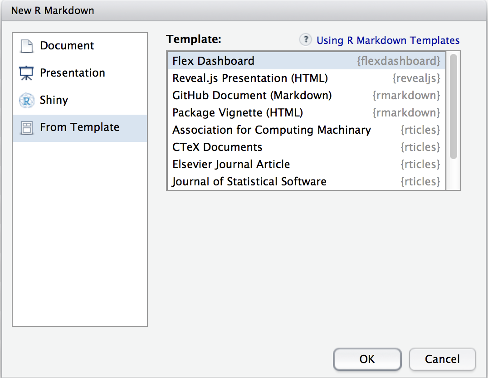
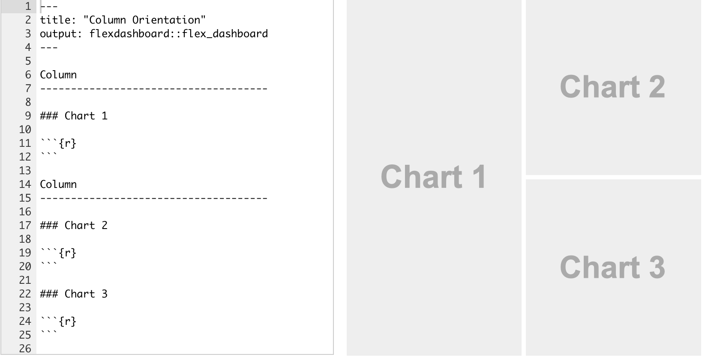
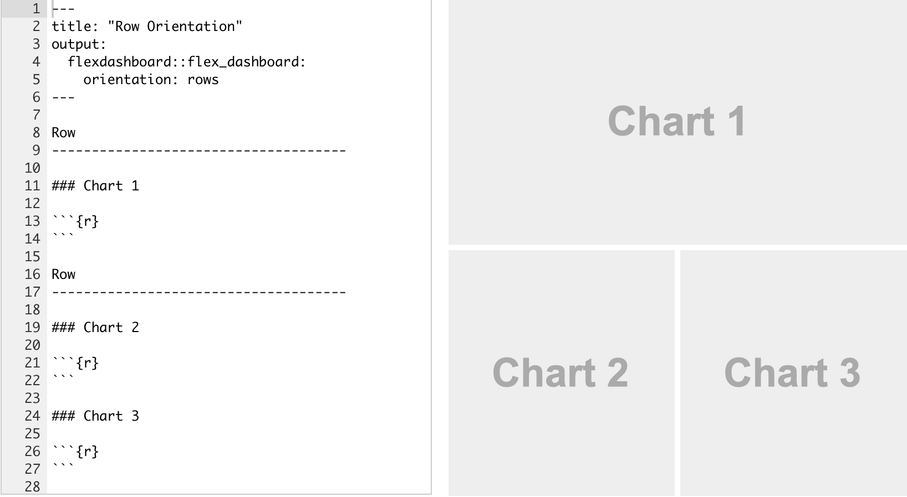
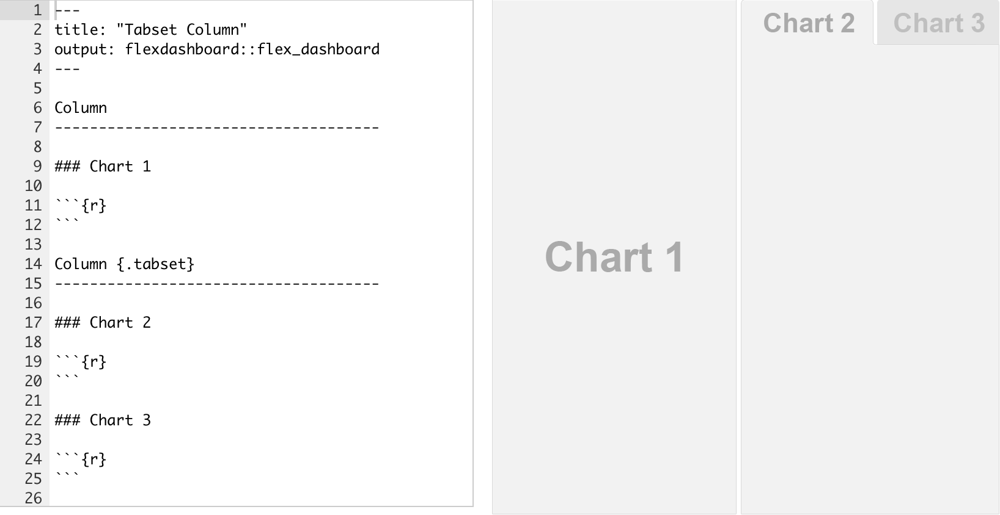
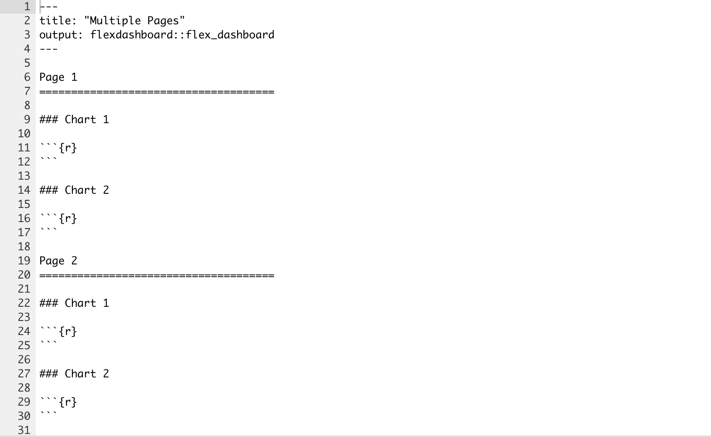
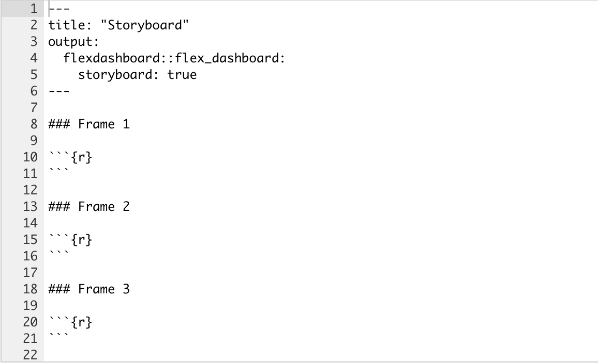
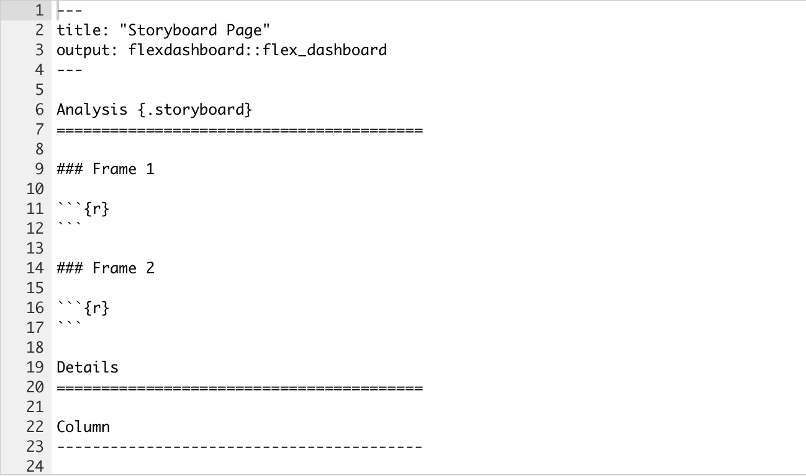
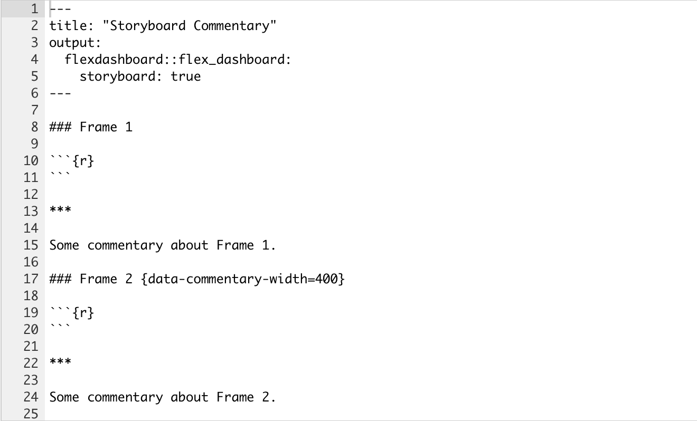

```{r setup, include=FALSE}
knitr::opts_chunk$set(echo = TRUE, warning = FALSE, fig.align = 'center')
library(flexdashboard)
library(DT)
library(leaflet)
library(leaflet.providers)
library(plotly)
library(dplyr)
library(ggplot2)
library(ggpubr)
library(gganimate)
library(lubridate)
library(hrbrthemes)
library(htmlwidgets)
library(crosstalk)
```

# HTML Widgets

El entorno de librerías *htmlwidgets* nos traen lo mejor de la visualización de datos en java al entorno R, con la posibilidad de incrustar widgets en documentos de R Mark down y aplicaciones web Shiny.

Incluyen las siguientes librerías:

-   **Leaflet**, es una biblioteca de JavaScript para crear mapas dinámicos que admiten el desplazamiento panorámico y el zoom junto con varias anotaciones como marcadores, polígonos y ventanas emergentes.

-   **dygraphs**, proporciona amplias funciones para representar gráficamente datos de series temporales en R e incluye compatibilidad con muchas características interactivas, como el resaltado de series/puntos, el zoom y el desplazamiento panorámico.

-   **Plotly**, permite traducir fácilmente sus gráficos ggplot2 a una versión interactiva basada en la web.

-   **rbokeh**, es una biblioteca de visualización que proporciona un marco declarativo flexible y potente para crear gráficos basados en la web.

-   **Highcharter**, proporciona una interfaz R enriquecida para la popular biblioteca de gráficos JavaScript de Highcharts.

-   **visNetwork**, proporciona una interfaz para las capacidades de visualización de red de la biblioteca vis.js.

-   **DataTable**, muestra matrices o marcos de datos de R como tablas HTML interactivas que admiten el filtrado, la paginación y la ordenación.

-   **metricsgraphics**, permite crear fácilmente diagramas de dispersión, gráficos de líneas e histogramas D3.

Hay más de 30.librerías en CRAN que nos proporcionan widgets. Podemos encontrar algunos ejemplos en [showcase](http://www.htmlwidgets.org/showcase_leaflet.html) así como consultar los ejemplos que aparecen en la galería. Nos centramos en la librería **flexdashboard**.

# La librería **flexdashboard**

La librería **flexdashboard** presenta algunas características muy interesantes para presentar la información gráfica en el formato de trabajo *RMarkdown*.

-   Se puede utilizar *RMarkdown* para publicar un grupo de visualizaciones de datos relacionados como un tablero.

-   Presenta soporte para una amplia variedad de componentes, incluidos *htmlwidgets*; gráficos de base, *lattice* y *grid*, datos tabulados, cajas de valores y anotaciones de texto.

-   Se pueden realizar diseños basados en filas y columnas flexibles y fáciles de especificar. Los componentes se redimensionan de forma inteligente para llenar el navegador y se adaptan para su visualización en dispositivos móviles.

-   Se pueden realizar diseños de guiones gráficos para presentar secuencias de visualizaciones y comentarios relacionados.

-   Opcionalmente, puede utilizar Shiny para desarrollar visualizaciones de forma dinámica.

Para crear un **flexdashboard**, creamos un documento *RMarkdown* con el formato de salida `flexdashboard::flex_dashboard`. Puede hacer esto desde RStudio usando el cuadro de diálogo `New RMarkdown`:

{width="500px"}

# Layout

## Single Column (Fill)

El diseño del dashboard se divide en columnas y filas, con componentes de salida delineados mediante encabezados de markdown de nivel 3 (\###). De forma predeterminada, los paneles se distribuyen en una sola columna, con gráficos apilados verticalmente dentro de una columna y dimensionados para llenar la altura disponible del navegador. Por ejemplo, este diseño define una sola columna con dos gráficos que llena el espacio disponible en el navegador.

```` yaml
---
title: "Single Column (Fill)"
output: 
  flexdashboard::flex_dashboard:
    vertical_layout: fill
---

### Chart 1
    
```{r}

```
    
### Chart 2

```{r}

```
````

Por defecto, el nivel 2 de cabeceras de markdown (------------------) dentro del dashboard nos define columnas. Vemos unos ejemplos a continuación.

{width="500px"}

{width="500px"}

## Scrolling Layout

Por defecto, los gráficos de flexdashboard están dispuestos para llenar automáticamente la altura del navegador. Esto funciona bien para una pequeña cantidad de gráficos apilados verticalmente, sin embargo, si tiene muchos gráficos, probablemente querrá desplazarse en lugar de ajustarlos todos en la página. Puede controlar este comportamiento utilizando la opción vertical_layout. Especifique relleno para redimensionar verticalmente los gráficos para que llenen completamente la página y se desplacen a los gráficos de diseño a su altura natural, desplazando la página si es necesario.

Basta con añadir esta línea en la cabecera del fichero.

``` yaml
---
title: "Chart Stack (Scrolling)"
output: 
  flexdashboard::flex_dashboard:
    vertical_layout: scroll
---
```

## Tabsets

Si tiene varios componentes que le gustaría mostrar dentro de una fila o columna, en lugar de intentar colocarlos todos en la pantalla al mismo tiempo, puede diseñarlos como un conjunto de pestañas. Esto es especialmente apropiado cuando un componente es principal (es decir, debe ser visto por todos los lectores) y los otros brindan información secundaria que podría ser de interés solo para algunos lectores.

En muchos casos *tabsets* representan una mejor solución que `vertical_layout: scroll` para exhibir un gran número de componentes ya que son tan sencillos de navegar.

Para diseñar una fila o columna como un conjunto de pestañas, simplemente agregue el atributo `{.tabset}` al encabezado de la sección. Por ejemplo, el siguiente código presenta la segunda columna con un conjunto de dos pestañas:

{width="500px"}

{width="500px"}

## Tabular Data

Es posible incluir datos tabulados en `flexdashboard` de una de estad formas:

-   Directamente en forma de tabla.

-   Utilizando la librería `DataTable` que incluye una mejor visualización de los datos.

### Simple Tabla

Una tabla simple es ideal para números más pequeños de registros (es decir, 40-50 o menos). El código requerido para tablas simples difiere dependiendo de si está creando un tablero flexible estático o dinámico (basado en Shiny). Para paneles estáticos, debe usar la función `knitr::kable` para generar su conjunto de datos, por ejemplo: `knitr::kable(mtcars)`.

Para paneles basados en Shiny, debe usar la función `shiny::renderTable`, por ejemplo:

``` yaml
renderTable({
  head(mtcars, n = input$rows)
})
```

### Data Table

La librería *DataTable* muestra matrices o marcos de datos de R como tablas HTML interactivas que admiten el filtrado, la paginación y la ordenación

Si queremos utilizar tablas realizadas con DataTables en flexdashboard deberíamos instalar la última versión de la libreríadesde CRAN (se realizan constantes mejores en la interacción entre estas librerías). Para incluir una DataTable la sintaxis que se emplea es `DT::datatable` como por ejemplo:

``` yaml
DT::datatable(mtcars, options = list(
  bPaginate = FALSE
))
```

Tenga en cuenta que especificamos la opción `bPaginate = FALSE`. Esto es apropiado para conjuntos de datos más pequeños donde el desplazamiento proporciona una forma cómoda de navegar a través de los datos.

Si tiene un conjunto de datos grande donde desea habilitar la paginación, debe asegurarse de especificar la opción `pageLength =` para mostrar más de las 10 filas predeterminadas de su conjunto de datos por página:

``` yaml
DT::datatable(mtcars, options = list(
  pageLength = 25
))
```

### Shiny

Para incluir una DataTable dentro de un Shiny flexdashboard debe asegurarse de ajustar la salida de la tabla de datos en `DT::renderDataTable` (para que se actualice cuando las entradas dependan del cambio). Por ejemplo:

``` yaml
DT::renderDataTable({
  data <- head(mtcars, n = input$maxrows)
  DT::datatable(data, options = list(
    bPaginate = FALSE
  ))
})
```

### Mobile Display

En las pantallas de escritorio y tableta, los componentes Tabla simple y Tabla de datos encajarán exactamente dentro de los límites de su contenedor de tablero flexible y proporcionarán una barra de desplazamiento para ver los registros que no caben en la pantalla. Sin embargo, en los teléfonos móviles ambos componentes nunca utilizarán una barra de desplazamiento (ya que eso competiría con el desplazamiento del panel general). Más bien, en diseños de teléfonos móviles:

-   La Tabla Simple mostrará todos los registros disponibles; y

-   El DataTable utilizará paginación (es decir, forzar `bPaginate = TRUE`).

## Navigation Bar

De forma predeterminada, la barra de navegación del flexdashboard incluye el título, el autor y la fecha del documento. Cuando un panel tiene varias páginas, los enlaces a las distintas páginas también se incluyen en el lado izquierdo de la barra de navegación. También puede agregar enlaces sociales y un enlace para ver el código fuente del panel.

Además, puede personalizar enlaces a la barra de navegación utilizando la opción de barra de navegación. Por ejemplo, lo siguiente agrega un enlace "Acerca de" en el lado izquierdo de la barra de navegación:

``` yaml
---
title: "Navigation Bar"
output: 
  flexdashboard::flex_dashboard:
    navbar:
      - { title: "About", href: "https://example.com/about", align: left }
---
```

Los elementos de la barra de navegación deben incluir un campo de título o de icono (o ambos). También debes incluir un *href* como destino de navegación. El campo de alineación es opcional (puede ser "left" o "right", siendo por defecto "right").

Véase [Icon Sets](https://rmarkdown.rstudio.com/flexdashboard/using.html#icon-sets) para ver cómo podemos incluir iconos en la barra de navegación.

### Social Links

Puede incluir enlaces a servicios para compartir en redes sociales a través de la opción social. Por ejemplo, el siguiente panel incluye enlaces de Twitter y Facebook, así como un menú desplegable con una lista más completa de servicios:

``` yaml
---
title: "Social Links"
output: 
  flexdashboard::flex_dashboard:
    social: [ "twitter", "facebook", "menu" ]
---
```

The social option can include any number of the following services: "facebook", "twitter", "google-plus", "linkedin", and "pinterest". You can also specify "menu" to provide a generic sharing drop-down menu that includes all of the services.

### Source Code

Puede incluir un enlace al código fuente del panel utilizando la opción código_fuente. El código fuente puede estar incrustado en el documento (código_fuente: embed) o puede ser un enlace a una URL donde se puede encontrar el código fuente en línea (por ejemplo, código_fuente: "<https://github.com/user/repo>"). Por ejemplo, el siguiente panel incluye una copia incrustada del código fuente que se puede ver haciendo clic en el botón "Código fuente" en la barra de navegación:

``` yaml
---
title: "Source Code"
output: 
  flexdashboard::flex_dashboard:
    source_code: embed
---
```

## Anotaciones de texto

**Secciones de Texto**

Si necesita incluir narrativa o explicación adicional dentro de su panel, puede hacerlo de las siguientes maneras: Puede incluir contenido en la parte superior de la página antes de que se introduzcan las secciones del panel.

Puede definir secciones del panel que no incluyan un gráfico, sino que incluyan contenido arbitrario (texto, imágenes, ecuaciones, etc.)

**Título y notas**. Cada componente dentro de un panel incluye secciones opcionales de título y notas. El título es simplemente el texto que sigue al encabezado de la sección de nivel 3 (\###). Las notas son cualquier texto precedido de \> después del fragmento de código que produce la salida del componente.

## Multiple Pages

Si tiene más de un cierto número de gráficos que le gustaría incluir en un panel, puede considerar dividir el panel en varias páginas. Para definir una página simplemente use un encabezado de rmarkdown de nivel 1 ​(==================). Cada página que defina tendrá su propia pestaña de navegación de nivel superior.

Por ejemplo, este código crea un panel con dos páginas, cada una de las cuales contiene dos gráficos:

{width="600px"}

## Orientación de las páginas

Tenga en cuenta que en este ejemplo ambas páginas utilizan la orientación predeterminada de "columnas". Sin embargo, es posible especificar una orientación distinta para una página individual. Esto se hace agregando el atributo de orientación de datos al encabezado de la página cuya orientación desea cambiar. Por ejemplo:

``` yaml
---
title: "Page Orientation"
output: flexdashboard::flex_dashboard
---

Page 1
=====================================


Page 2 {data-orientation=rows}
=====================================  
```

## Page Navigation

De forma predeterminada, cada página que defina recibe su propia pestaña de nivel superior en la barra de navegación. Sin embargo, si tiene una gran cantidad de páginas (más de 5), es posible que desee organizarlas en menús en la barra de navegación.

Para especificar que se debe acceder a una página a través del menú de la barra de navegación, utilice el atributo data-navmenu. Por ejemplo, el siguiente panel tiene 4 páginas, 2 de las cuales están ubicadas en el "Menú A" y dos en el "Menú B":

``` yaml
---
title: "Page Navigation Menus"
output: flexdashboard::flex_dashboard
---

Page 1 {data-navmenu="Menu A"}
=====================================


Page 2 {data-navmenu="Menu A"}
=====================================  


Page 3 {data-navmenu="Menu B"}
=====================================


Page 4 {data-navmenu="Menu B"}
===================================== 
```

## Page Links

Podemos introducir directamente links directoa a páginas dashboard utilizando la sintaxis estándar de markdown: `[Page 2]`. TPara utilizar texto de enlace personalizado, también puede crear un enlace a través del ancla de la página: `[Page Two](#page-2)`.

## Page Icons

Puede agregar un ícono al menú de navegación de una página usando el atributo de ícono de datos. Por ejemplo, lo siguiente especifica un icono de barra de navegación para cada una de las dos páginas:

``` yaml
---
title: "Page Icons"
output: flexdashboard::flex_dashboard
---

Page 1 {data-icon="fa-list"}
=====================================


Page 2 {data-icon="fa-hashtag"}
=====================================  
```

# Storyboards

Storyboards son una alternativa a los esquemas de diseño basados en filas y columnas descritos anteriormente y que son muy adecuados para presentar una secuencia de visualizaciones de datos y comentarios relacionados.

## Storyboard Basics

Para crear un storyboard, haga lo siguiente:

-   Añadir la opción `the storyboard: true` a la cabecera del documento.

-   Incluya un conjunto de componentes del panel de nivel 3 (\###). A cada componente se le asignará su propio marco en el storyboard, y el título de la sección se utilizará como título de navegación..

Los conceptos básicos de la creación de guiones gráficos se explican a continuación. Para ver un ejemplo más completo, consulte el storyboard [HTML Widgets Showcase](https://beta.rstudioconnect.com/jjallaire/htmlwidgets-showcase-storyboard/htmlwidgets-showcase-storyboard.html).

El siguiente código crea un guión gráfico con 3 fotogramas:

{width="600px"}

Tenga en cuenta que los títulos de las secciones de nivel 3 (por ejemplo, "Frame 1") se utilizarán como títulos de navegación. Estos títulos deben proporcionar un resumen del marco de una o dos oraciones, por lo que normalmente serán más largos que lo que se ilustra aquí.

## Storyboard Pages

Puede diseñar una o más páginas de un panel como storyboards y luego usar el diseño tradicional de filas y columnas en las otras páginas. Para hacer esto, excluye la opción `storyboard: true` y en su lugar agrega la clase `{.storyboard}` a las páginas que deseas diseñar como storyboards.

Por ejemplo, el siguiente panel incluye un guión gráfico en la primera página ("Análisis"), así como otra página ("Detalles") que utiliza un diseño convencional:

{width="600px"}

## Commentary

Es posible que desees agregar comentarios junto a los fotogramas de tu storyboard. Para hacer esto, agregue una regla de separación horizontal (\*\*\*) después del cuerpo principal del contenido del marco. El contenido después del separador aparecerá en una barra lateral de comentarios a la derecha. Por ejemplo:

{width="600px"}

Tenga en cuenta que el segundo cuadro incluye un atributo `data-commentary-width=400`. De forma predeterminada, el ancho de la barra lateral de comentarios es de 300 píxeles; puede utilizar el ancho de comentario de datos para modificarlo fotograma por cuadro.

# Apariencia

## Themes

Hay una variedad de temas disponibles para modificar la apariencia básica de flexdashboard. Los temas disponibles incluyen:

**default**, **cosmo**, **bootstrap**, **cerulean**, **journal**, **flatly**, **readable**, **spacelab**, **united**, **lumen**, **paper**, **sandstone**, **simplex**, **yeti**.

El tema cosmo se utiliza cuando se especifica "predeterminado". Todos estos temas se basan en los temas disponibles en el paquete R Markdown (que a su vez se basan en temas de Bootswatch).

Utilice la opción de `theme` para especificar un tema alternativo:

``` yaml
---
title: "Themes"
output: 
  flexdashboard::flex_dashboard:
    theme: bootstrap
---
```

NOTA: debemos escribir el código anterior exactamente de esa forma. Si escribimos

``` yaml
output: flexdashboard::flex_dashboard: theme: bootstrap
```

no funciona, proporciona un error.

# Vemos algunos ejemplos de presentación de la información relacionada con los tweets

-   Ejemplo1.Rmd: Datos sobre tweets de Roma.

-   Ejemplo2.Rmd: Otro caso de presentación de datos.

> Ejercicio. Nos hacemos la siguiente pregunta: ¿disminuyó la criminalidad con la pandemia que sufrimos hace unos años? Diseña un *dashboard* con los datos que te ofrecen las 4 tablas siguientes: *crimen_spain.csv*, *evolucion_criminalidad.csv*, *homicidios.csv*, *infracciones_penales.csv*, *robos_vehículos.csv*.

# Algunas referencias.

-   Shiny with flexdashboard: <https://rmarkdown.rstudio.com/flexdashboard/shiny.html>

-   Layouts: <https://rmarkdown.rstudio.com/flexdashboard/layouts.html>

-   Examples: <https://rmarkdown.rstudio.com/flexdashboard/examples.html>
